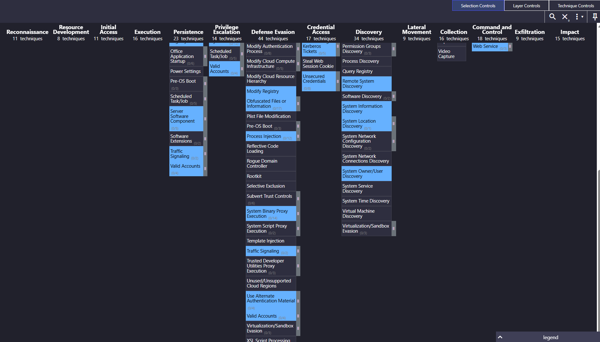

# Detection Engineering: EQL Sequence Rule & MITRE ATT&CK Validation

## Objective

Engineer a full detection pipeline against a live adversary attack simulation. Starting from zero telemetry, build out Sysmon + Windows Advanced Audit Policy instrumentation on a Windows Server 2022 Domain Controller, execute a four-stage attack chain from Kali Linux, and develop an EQL sequence detection rule in Elastic Security that intercepts the kill chain at earliest execution — triggering a confirmed alert on first adversary activity.

---

## Lab Environment

| Component | Details |
|---|---|
| **Hypervisor** | VMware Workstation Player 17 |
| **Target Host** | Windows Server 2022 — Domain Controller (`cs.local`) |
| **DC IP Address** | 192.168.9.142 (Ethernet1 adapter) |
| **Attacker Machine** | Kali Linux |
| **Kali eth1 IP (static)** | 10.0.0.5 |
| **Kali VMNet IP** | 192.168.9.136 |
| **SIEM** | Elastic Security (Elasticsearch + Kibana) |
| **Endpoint Telemetry** | Sysmon — SwiftOnSecurity `sysmonconfig-export.xml` |
| **Audit Policy** | Windows Advanced Audit Policy — Process Creation + Command Line Logging |
| **Network** | Isolated intentionally-vulnerable Active Directory lab domain |

---

## Phase 0: Telemetry Infrastructure Setup

Before any attack simulation, the telemetry stack was fully instrumented and validated. Two hard gates were required to proceed: Event ID 1 (process creation with full command line arguments) and Event ID 3 (network connection attribution).

### Sysmon Deployment

Sysmon was deployed using the SwiftOnSecurity `sysmonconfig-export.xml` configuration — a production-grade filter set that eliminates high-volume benign telemetry noise while retaining full fidelity on process creation, file writes, registry modifications, and attack-grade network connections. This config is the industry baseline for endpoint visibility in Windows environments.


### Windows Advanced Audit Policy Configuration

Three audit policy controls were activated on the Domain Controller to ensure Sysmon Event ID 1 captured full command line arguments for every process execution:

1. **Force Audit Policy Subcategory Settings** — enabled to prevent Group Policy from overriding granular subcategory audit controls
2. **Include Command Line in Process Creation Events** — enabled to populate `process.command_line` in every Event ID 1 log
3. **Advanced Audit: Process Creation** — enabled to generate Event ID 4688 / Sysmon Event ID 1 on every process spawn


### Kali Linux Network Attribution

Kali eth1 was assigned static IP `10.0.0.5` to establish a dedicated, deterministic attack interface. All adversary-originated traffic is attributable to this address in SIEM telemetry, eliminating ambiguity between DHCP-assigned addresses and attack-sourced connections.


### Telemetry Validation

Phase 0 was gated on a verified Elastic query confirming `process.command_line` population in Event ID 1 logs. A verification command was executed on the DC and queried in Kibana to confirm end-to-end telemetry flow before attack execution began.

```
gpupdate /force
whoami /priv ; echo "Phase0_CommandLine_Verification_Test"
```

Event ID 3 (Network Connection) returned no results against internal subnet traffic — confirmed as expected behavior. The SwiftOnSecurity config applies `onmatch=exclude` filtering against ICMP and internal subnet activity by design. This is production-grade noise reduction, not a misconfiguration. Event ID 3 will trigger on attack-grade lateral movement.


**Phase 0 Status: COMPLETE — full forensic telemetry operational, attack simulation cleared to proceed.**

---

## Phase 1: Adversary Attack Simulation

A four-stage attack chain was executed from Kali Linux against the Windows Server 2022 Domain Controller to generate authentic adversary telemetry in Elastic.

### Stage 1 — Reconnaissance: `whoami` Execution

Initial execution: `whoami` run on the DC to establish process creation telemetry and confirm attacker-controlled execution context. This is the entry point of the kill chain — the first signal visible in SIEM.


### Stage 2 — Payload Staging

Payload staging activity executed on the DC. File creation events generated as part of the staging sequence — the file write artifacts that EQL sequence detection subsequently targets as its second stage trigger.


### Stage 3 — PowerShell Download Execution

PowerShell invoked for remote payload retrieval. `DownloadString` / `IEX` execution pattern used — a high-signal adversary TTP captured in full via Sysmon Event ID 1 with command line argument logging active.


### Stage 4 — Registry Persistence

Persistence established via Windows Registry Run key modification — `HKCU\Software\Microsoft\Windows\CurrentVersion\Run`. Sysmon Event ID 13 (Registry Value Set) captures this artifact with full key path and value data.


### Telemetry Verification

All four attack stages confirmed visible in Elastic. Full command line arguments present in Event ID 1 logs. Registry modification artifacts confirmed in Event ID 13. Attack chain telemetry validated before rule development.


---

## Phase 2: Multi-Stage EQL Detection Engineering

### Detection Architecture

The EQL sequence rule was engineered to intercept the kill chain at earliest execution — targeting the `whoami` execution → file creation sequence as the detection primitive. This two-stage approach was selected deliberately.

**Field mapping analysis during rule development identified that `process.command_line` and `registry.path` are not consistently indexed in Elastic's ECS field schema for all Sysmon event types in this environment.** Process execution events (Event ID 1) and file creation events (Event ID 11) carry fully indexed fields that EQL sequence matching operates against cleanly. By targeting `whoami.exe` execution as Stage 1 and the file creation artifact as Stage 2, the rule catches the adversary at the earliest point in the kill chain — before payload execution, before PowerShell download, before persistence is established.

This is early-stage kill chain interception by design: the moment an attacker runs `whoami` and drops a file on a domain controller, the sequence fires. Everything downstream — the PowerShell, the registry key — is already a response action, not a detection window.

### EQL Sequence Rule

The rule targets two correlated events within a 1-hour window, linked by `host.name` to prevent cross-host false positives. `host.name` correlation ensures both sequence events must originate from the same endpoint — a domain controller running `whoami` followed by a file creation on that same host.

```eql
sequence by host.name with maxspan=1h
  [process where event.type == "start" and process.name == "whoami.exe"]
  [file where event.type == "creation"]
```

### Rule Activation and Full Attack Chain Re-Execution

The detection rule was activated in Elastic Security. The full four-stage attack chain was re-executed end-to-end to validate rule firing under live adversary conditions.


---

## Alert Validation

The EQL sequence rule fired at **7:06 PM EDT, May 5, 2026**.

Both sequence conditions were satisfied: `whoami.exe` process creation followed by a file creation event, correlated on `host.name` within the configured maxspan window. Alert generation confirmed in Elastic Security detection engine.


---

## MITRE ATT&CK Framework Validation

Validated detection capabilities and identified coverage gaps using Security Onion's rules coverage overview.


*Security Onion MITRE ATT&CK Navigator visualizing detection coverage. Blue tiles indicate active Sigma and Suricata rules mapped to specific techniques, validating current detection capabilities. Grey/black tiles identify specific detection gaps (e.g., Reconnaissance, Resource Development) for future rule engineering.*

---

## Key Takeaways

**Telemetry gates matter before detection engineering.** `gpupdate /force` was required to sync Windows Advanced Audit Policy and populate `process.command_line` in Event ID 1 logs. Without that step, EQL rules operating on command line content return no matches — silent failures with no error.

**SwiftOnSecurity's suppression of internal Event ID 3 traffic is intentional.** ICMP and internal subnet network connections are excluded by the config's `onmatch=exclude` rules. This is production behavior, not a bug. Event ID 3 will fire on actual attack-grade external network movement.

**EQL `sequence by host.name` is the correct correlation primitive for single-host attack chains.** Without `host.name` binding, a `whoami.exe` execution on any host in the environment satisfies Stage 1 of the rule — producing false positives across unrelated endpoints.

**Early kill chain detection outperforms full-chain detection for response time.** A rule that fires on `whoami.exe` + file creation gives the analyst a detection window before PowerShell execution and before persistence is established. The downstream stages become confirmation, not the trigger.

**Field mapping validation is a prerequisite for EQL rule development.** `process.command_line` and `registry.path` field availability must be confirmed in the index before building rules that reference them. EQL silently returns no results when a queried field is unindexed — not an error state, just empty.
