# Detection Engineering: EQL Sequence Rule and MITRE ATT&CK Validation

This project was completed in an isolated Active Directory lab built for detection engineering practice.

---

## Project Overview

This project focuses on building and validating a small Elastic EQL detection workflow from the ground up.

The goal was to practice how endpoint telemetry, Windows audit policy, Sysmon, Elastic, and MITRE ATT&CK mapping work together during detection engineering. I configured telemetry on a Windows Server 2022 Domain Controller, validated that process command-line data was reaching Elastic, simulated a controlled multi-stage attack sequence, and built an EQL sequence rule that generated an alert when `whoami.exe` execution was followed by file creation on the same host.

The final detection rule was intentionally scoped to a two-stage pattern:

1. `whoami.exe` execution
2. File creation of `C:\Users\Public\payload.exe`

The project also includes supporting activity such as a PowerShell download attempt, registry Run key persistence, and MITRE ATT&CK coverage review. Those later actions helped provide context, but they were not all part of the final EQL sequence rule.

---

## Why I Built This Project

Detection rules are only useful when the telemetry behind them is working.

I built this lab to practice the detection engineering process:

1. Configure endpoint telemetry.
2. Validate that logs and fields are populated.
3. Simulate attacker-like behavior.
4. Build an EQL sequence rule.
5. Trigger and review the alert.
6. Document what the rule detects and what it does not detect.

This project helped me understand that detection engineering is not just writing a rule. The harder part is making sure the data exists, the fields are indexed correctly, and the rule logic matches the behavior being tested.

---

## Lab Environment & Architecture

## Architecture

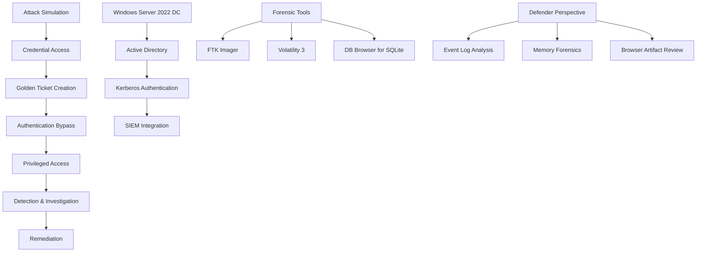

*Note: This diagram represents the lab environment and investigation workflow.*

| Component | Details |
|---|---|
| Hypervisor | VMware Workstation Player 17 |
| Target Host | Windows Server 2022 Domain Controller |
| Domain | `cs.local` |
| DC IP Address | `192.168.9.142` |
| Kali Linux VMNet IP | `192.168.9.136` |
| Kali eth1 Static IP | `10.0.0.5` |
| SIEM | Elastic Security / Kibana |
| Endpoint Telemetry | Sysmon with SwiftOnSecurity `sysmonconfig-export.xml` |
| Windows Logging | Advanced Audit Policy, process creation auditing, command-line logging |
| Detection Language | Elastic EQL |

---

## Tools & Technologies Used

| Tool | Purpose |
|---|---|
| Sysmon | Collected endpoint telemetry such as process creation, file creation, and registry activity |
| SwiftOnSecurity Sysmon Config | Provided a practical Sysmon configuration with noise reduction |
| Windows Advanced Audit Policy | Enabled process creation auditing and command-line visibility |
| Elastic / Kibana | Reviewed telemetry and created the EQL detection rule |
| Kali Linux | Provided the attacker/testing system and static test interface |
| MITRE ATT&CK Coverage View | Reviewed mapped detection coverage and gaps |

---

## Project Flow

The project followed this sequence:

1. Prepared Sysmon and the SwiftOnSecurity configuration.
2. Installed Sysmon on the Domain Controller.
3. Enabled Windows audit policy settings needed for process visibility.
4. Enabled command-line logging for process creation events.
5. Configured Kali networking for a stable lab IP.
6. Verified process command-line telemetry in Elastic.
7. Simulated the first attack stage with `whoami`.
8. Created a staged file at `C:\Users\Public\payload.exe`.
9. Attempted PowerShell remote script execution.
10. Added a registry Run key for persistence simulation.
11. Reviewed attack telemetry in Elastic.
12. Built and enabled an EQL sequence rule.
13. Re-ran the activity to validate alert generation.
14. Reviewed MITRE ATT&CK coverage to understand mapped visibility and gaps.

---

## Phase 0: Telemetry Setup

Before building the detection rule, I configured the endpoint telemetry needed for Elastic to see the activity.

This phase mattered because an EQL rule cannot work if the required logs or fields are missing.

---

## Sysmon Binary and Configuration

Sysmon and the SwiftOnSecurity configuration were prepared on the Windows Server system.

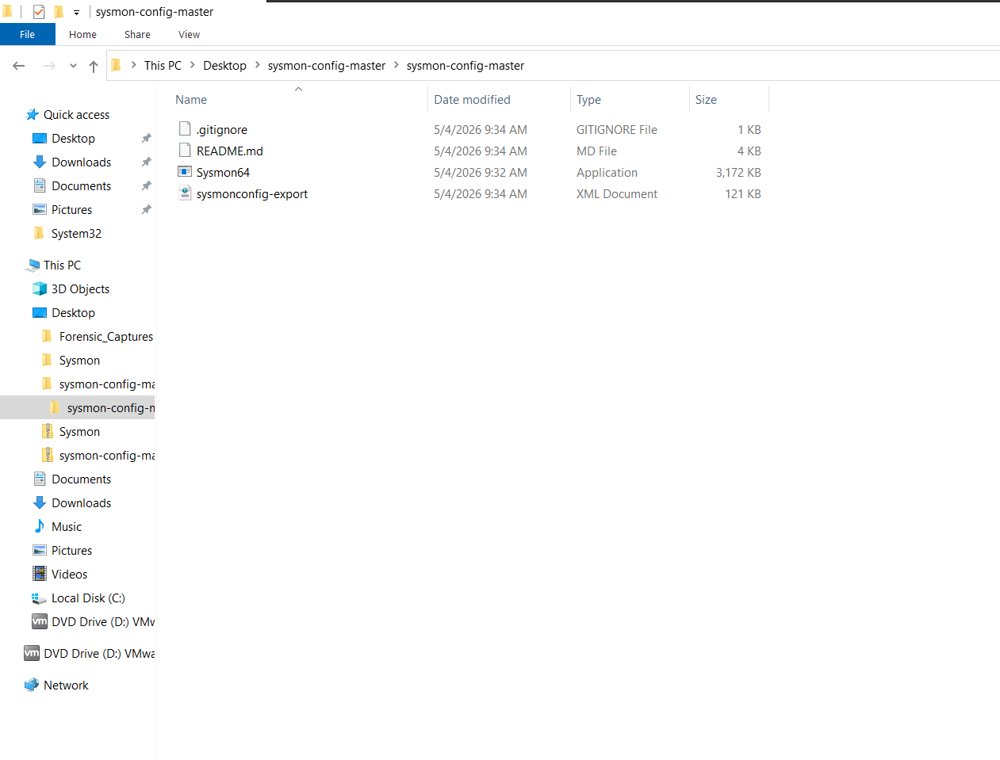

## What this proved

This confirmed that the Sysmon binary and configuration file were available before installation.

The SwiftOnSecurity configuration helped reduce noisy telemetry while still collecting useful endpoint events such as process creation, file creation, and registry activity.

---

## Sysmon Installation

Sysmon was installed using the configuration file.

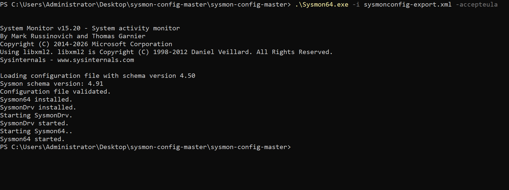

## What this proved

This confirmed that Sysmon installed successfully and started collecting endpoint telemetry.

This was the first telemetry gate. Without Sysmon running, the file and process events needed for the EQL rule would not be available.

---

## Audit Policy Subcategory Enforcement

Windows audit policy subcategory enforcement was enabled.

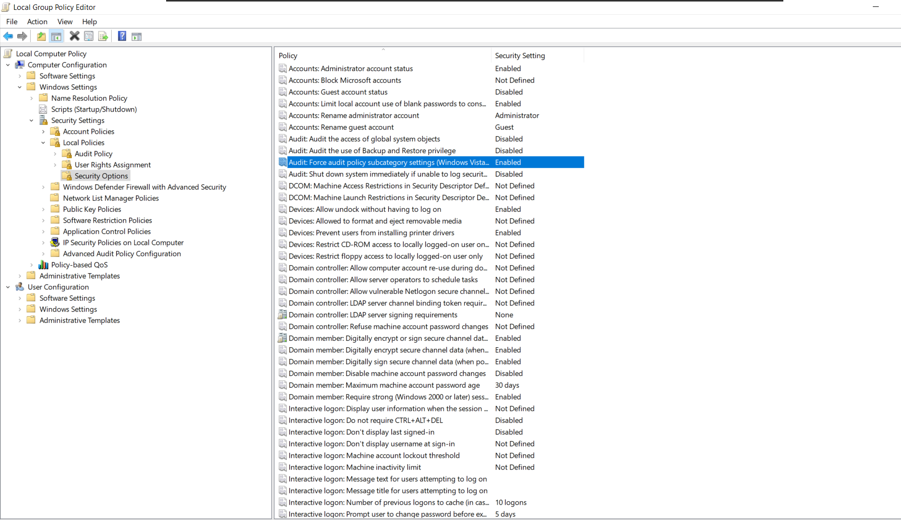

## What this proved

This confirmed that granular audit policy settings were enabled and would take priority over broader audit policy categories.

This helped ensure that the specific process creation settings applied correctly.

---

## Command-Line Logging for Process Creation

Command-line logging was enabled for process creation events.

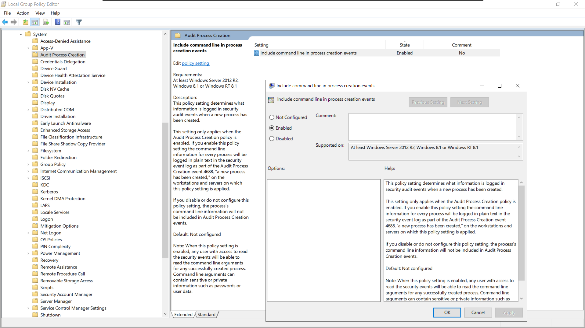

## What this proved

This confirmed that process command-line arguments would be included in process creation telemetry.

This mattered because command-line visibility is often the difference between seeing that `powershell.exe` ran and understanding what it actually tried to do.

---

## Advanced Audit Process Creation

Advanced Audit Policy was configured to capture process creation events.

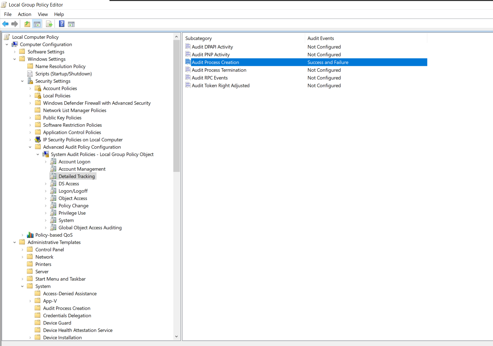

## What this proved

This confirmed that process creation auditing was enabled for success and failure events.

Together, Sysmon and Windows audit policy gave the lab enough visibility to test process execution and command-line telemetry.

---

## Phase 1: Kali Network Setup

Kali Linux had multiple network interfaces. I reviewed the interface list before assigning a static address.

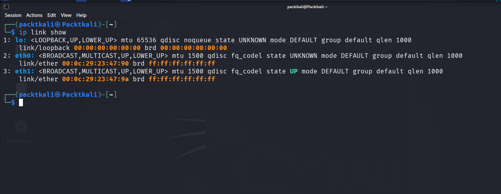

A static IP address was then assigned to `eth1`.

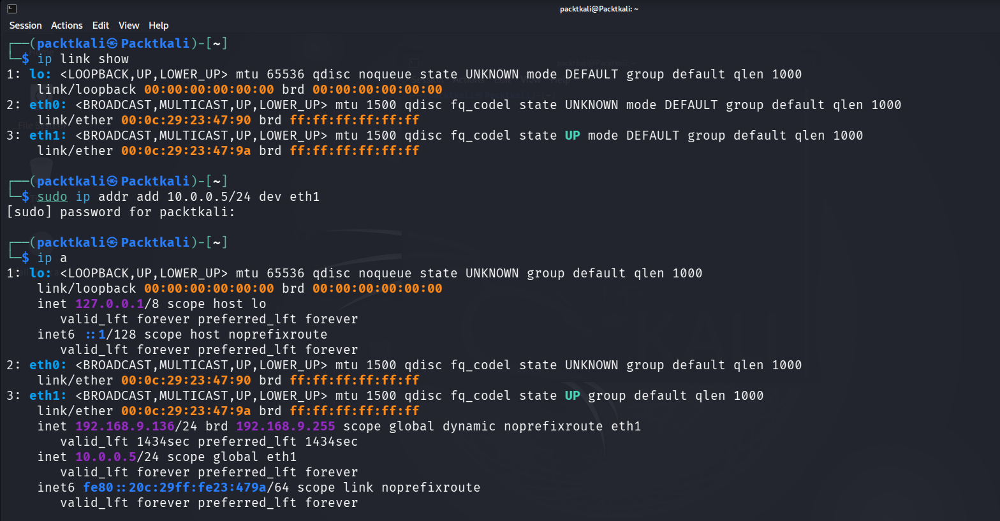

## What this proved

This confirmed that Kali had a stable lab address for testing.

The `eth1` interface showed:

`10.0.0.5/24`

The Kali VMNet address also appeared as:

`192.168.9.136`

This helped keep the test environment predictable when reviewing source or destination activity.

---

## Phase 2: Telemetry Validation in Elastic

Before running the attack simulation, I validated that Elastic was receiving process command-line data.

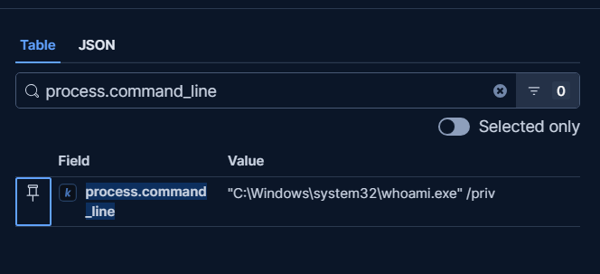

## What this proved

This screenshot confirmed that `process.command_line` was populated in Elastic.

That was important because missing command-line data would make later investigation and rule development weaker.

This was one of the most important lessons from the project: verify telemetry before writing rules.

---

## Phase 3: Attack Simulation

The attack simulation was designed to generate endpoint telemetry for detection testing.

The activity included:

1. User/context discovery with `whoami`
2. File creation at `C:\Users\Public\payload.exe`
3. PowerShell remote script execution attempt
4. Registry Run key persistence simulation

This was a controlled lab sequence. It should be understood as detection practice, not a real compromise.

---

## Stage 1: `whoami` Execution

The first activity was running `whoami` on the Domain Controller.

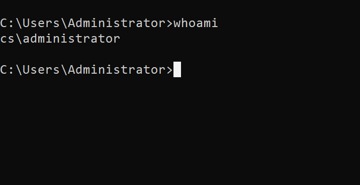

## What this proved

This confirmed execution under the `cs\administrator` context.

From a detection perspective, `whoami.exe` can be useful as an early discovery signal, but by itself it is noisy. Administrators and scripts can run `whoami` for legitimate reasons.

That is why the final detection did not alert on `whoami.exe` alone. It used `whoami.exe` followed by file creation on the same host.

---

## Stage 2: File Creation and Early Attack Telemetry

A file was staged by copying `calc.exe` to `C:\Users\Public\payload.exe`.

The simulation also included a DNS lookup attempt for a suspicious domain.

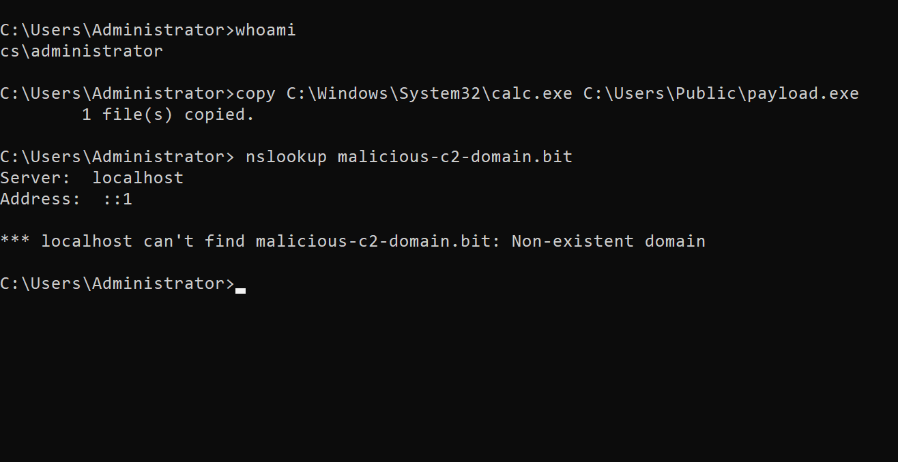

## What this proved

This screenshot supports two important pieces of activity:

- File creation at `C:\Users\Public\payload.exe`
- DNS lookup attempt for `malicious-c2-domain.bit`

The DNS lookup failed because the domain did not exist. That is still useful as telemetry, but it should not be described as successful command-and-control activity.

The file creation event became the second stage of the final EQL sequence rule.

---

## Stage 3: PowerShell Download Attempt

PowerShell was used to attempt remote script retrieval with `DownloadString`.

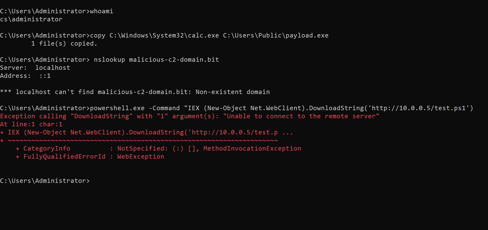

## What this proved

This screenshot shows a PowerShell download attempt using:

`IEX (New-Object Net.WebClient).DownloadString(...)`

The attempt failed because the remote server was unreachable.

This is important: the screenshot supports an attempted PowerShell download pattern, but it does not prove successful payload retrieval or execution.

From a detection perspective, the command line is still useful because `IEX`, `DownloadString`, and remote script retrieval patterns are suspicious even when the connection fails.

---

## Stage 4: Registry Persistence Simulation

A registry Run key was added to simulate persistence.

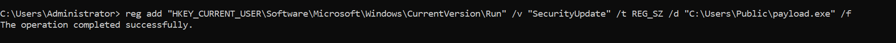

## What this proved

This confirmed that a Run key value was added under:

`HKCU\Software\Microsoft\Windows\CurrentVersion\Run`

The value pointed to:

`C:\Users\Public\payload.exe`

This supported the persistence portion of the lab. However, this registry step was not included in the final EQL sequence rule because the active rule was scoped to process execution followed by file creation.

---

## Phase 4: Elastic Telemetry Review

After the attack simulation, Elastic was used to review whether the activity appeared in telemetry.

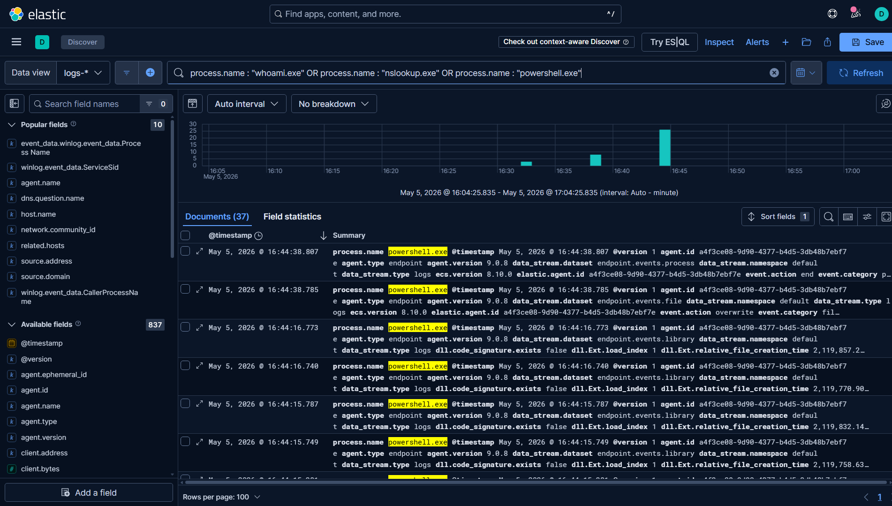

## What this proved

This screenshot confirmed that Elastic contained process-related telemetry from the activity, including PowerShell-related events.

The important point was not that every action was automatically detected. The important point was that the telemetry existed and could be searched, reviewed, and used for detection engineering.

---

## Phase 5: EQL Detection Rule

The final EQL rule was built as a two-stage sequence.

It looked for:

1. `whoami.exe` execution
2. File creation of `C:\Users\Public\payload.exe`

Both events had to occur on the same host within the configured time window.

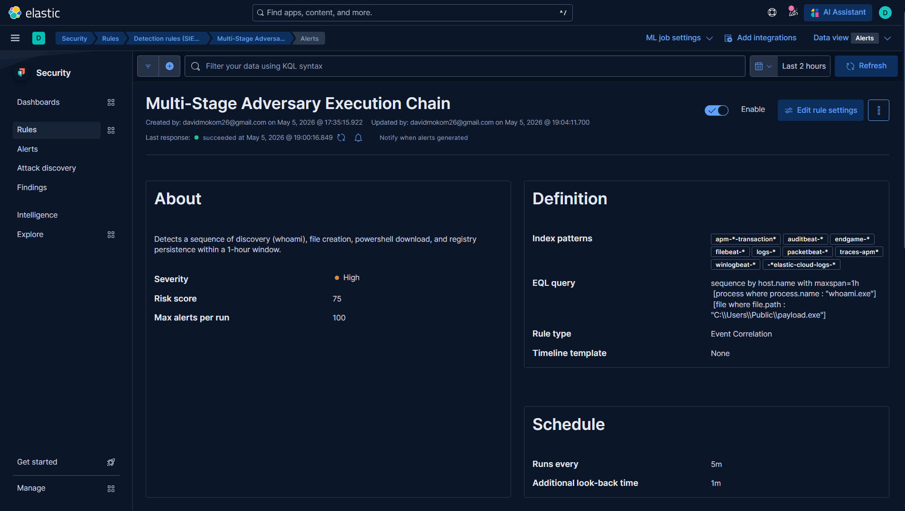

## EQL Rule

```eql
sequence by host.name with maxspan=1h
  [process where process.name : "whoami.exe"]
  [file where file.path : "C:\\Users\\Public\\payload.exe"]
```

## Why this rule was built this way

The rule was intentionally simple and focused.

`whoami.exe` alone is not enough for a strong detection because it can be legitimate. File creation alone can also be common. But when `whoami.exe` is followed by creation of a staged payload file on the same host, the sequence becomes more interesting in a lab detection context.

The `host.name` correlation matters because it prevents unrelated events from different machines from satisfying the same sequence.

## What this rule does not detect

This rule does not detect the entire attack chain.

It does not directly include:

- PowerShell DownloadString activity
- DNS lookup attempts
- Registry Run key persistence
- MITRE ATT&CK coverage as a whole

Those activities were reviewed as supporting telemetry, but the final EQL alert was based on the two-stage sequence.

---

## Phase 6: Rule Re-Execution and Alert Validation

After enabling the rule, the attack sequence was re-run to validate whether Elastic would generate an alert.

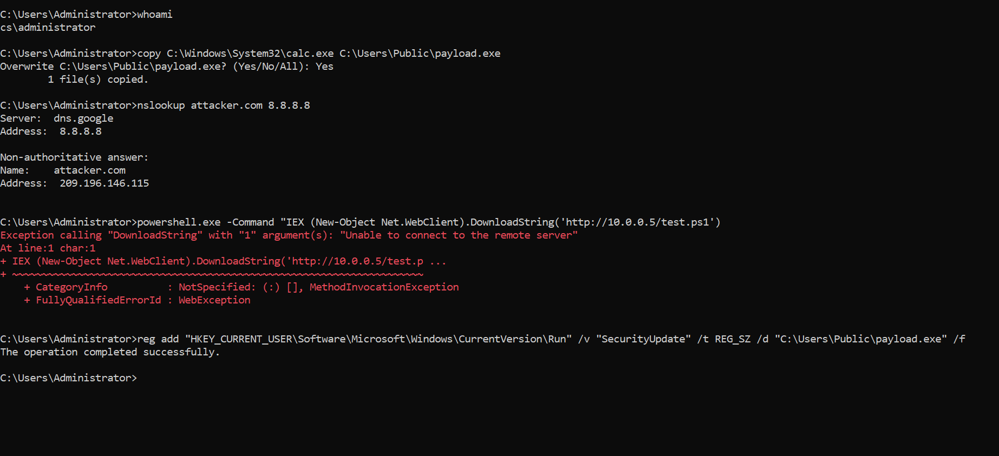

## What this proved

This showed the test activity being re-executed after the EQL rule was enabled.

The sequence included user discovery, file staging, PowerShell download attempt, and registry persistence simulation.

Again, the PowerShell download attempt failed because the remote server was unreachable. The detection validation still worked because the EQL rule was based on `whoami.exe` followed by file creation.

---

## Alert Generation

Elastic generated an alert for the EQL sequence rule.

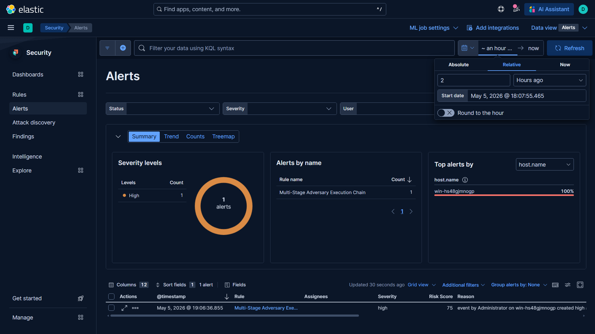

## What this proved

This confirmed that the EQL sequence rule fired successfully.

The alert shown was:

`Multi-Stage Adversary Execution Chain`

The alert was high severity and tied to the host:

`win-hs48gjmnogp`

This validated the rule logic in the lab environment.

---

## Phase 7: MITRE ATT&CK Coverage Review

MITRE ATT&CK coverage was reviewed using the Security Onion coverage view.


## What this proved

This screenshot showed mapped rule coverage across ATT&CK techniques.

It should be treated as a coverage overview, not proof that this one custom EQL rule covered every highlighted technique.

The value of this step was understanding where detection coverage existed and where gaps may remain.

---

## Detection Logic Explained

The detection rule used three key ideas:

### 1. Sequence logic

The rule looked for ordered behavior:

1. Process execution
2. File creation

This is different from a single-event alert because the rule cares about the relationship between events.

### 2. Host correlation

The sequence used `host.name` so both events had to happen on the same machine.

Without that correlation, a `whoami.exe` event on one host and a file creation event on another host could accidentally satisfy the rule.

### 3. Time window

The sequence used a one-hour window.

That gave enough time for the staged behavior to occur while still keeping the events close enough to be related.

---

## Key Findings & Analysis

### 1. Telemetry validation came before rule writing

The most important part of the project was proving that the logs and fields existed before building the EQL rule.

### 2. Command-line visibility mattered

The command-line logging screenshot confirmed that Elastic had useful process command-line data. This helped with investigation and validation.

### 3. The PowerShell command failed, but still created useful telemetry

The failed download attempt still showed suspicious command-line behavior. That is useful for analysis, but it should not be described as a successful payload download.

### 4. The final EQL rule was intentionally scoped

The rule detected `whoami.exe` followed by file creation of `C:\Users\Public\payload.exe`.

It did not detect every stage of the simulation.

### 5. Registry persistence was supporting telemetry

The Run key modification was part of the simulation, but it was not part of the final EQL sequence rule.

### 6. MITRE coverage needs careful interpretation

The ATT&CK view showed mapped detection coverage, but it should not be overstated as proof that this project fully covered every highlighted technique.

---

## Limitations

This was a controlled home lab, not a production detection pipeline.

Important limitations:

- The EQL rule was built for a specific lab pattern.
- `whoami.exe` can be noisy in real environments.
- File creation at `C:\Users\Public\payload.exe` was intentionally controlled.
- The PowerShell download attempt failed, so it should not be described as successful payload retrieval.
- The registry persistence action was not part of the final EQL sequence rule.
- The MITRE screenshot shows coverage mapping, not full detection validation.
- Production tuning would require testing against normal administrator behavior and broader endpoint telemetry.

---

## Improvements for a Future Version

If I expanded this project, I would improve it by:

- Adding registry persistence into a separate detection rule after confirming reliable registry field mapping.
- Building a separate rule for suspicious PowerShell command-line patterns.
- Testing against benign admin activity to reduce false positives.
- Adding Sysmon Event ID references in the README for each major event type.
- Capturing clearer screenshots of the exact EQL alert event details.
- Testing the same rule across more than one host.
- Building a short detection timeline that maps each simulated action to the Elastic evidence.

---

## Screenshot Evidence

| Screenshot | What It Shows |
|---|---|
| `screenshots/01_Sysmon_Binary_And_Config_Ready.png` | Sysmon binary and configuration file ready |
| `screenshots/02_Sysmon_Installation_Complete.png` | Sysmon installed successfully |
| `screenshots/03_Force_Audit_Policy_Subcategory_Enabled.png` | Audit policy subcategory enforcement enabled |
| `screenshots/04_Include_Command_Line_In_Process_Creation_Enabled.png` | Command-line logging enabled for process creation |
| `screenshots/05_Advanced_Audit_Process_Creation_Enabled.png` | Advanced Audit Process Creation enabled |
| `screenshots/06_Kali_Network_Interfaces_List.png` | Kali network interfaces before static IP assignment |
| `screenshots/07_Kali_Static_IP_Assigned.png` | Kali `eth1` configured with `10.0.0.5/24` |
| `screenshots/08_Elastic_Command_Line_Verification_Success.png` | Elastic showing populated `process.command_line` |
| `screenshots/09_Phase1_Whoami_Execution.png` | `whoami` executed as `cs\administrator` |
| `screenshots/10_Phase1_Attack_Chain_Telemetry.png` | File staging and suspicious DNS lookup attempt |
| `screenshots/11_Phase1_PowerShell_Execution.png` | PowerShell `DownloadString` attempt with connection failure |
| `screenshots/12_Phase1_Persistence_Establishment.png` | Registry Run key persistence simulation |
| `screenshots/13_Elastic_Attack_Telemetry_Verification.png` | Elastic review of attack-related process telemetry |
| `screenshots/14_Multi_Stage_Rule_Activation.png` | EQL sequence rule enabled in Elastic |
| `screenshots/15_Full_Attack_Chain_Reexecution.png` | Attack sequence re-executed for validation |
| `screenshots/16_EQL_Sequence_Alert_Generation.png` | EQL alert generated successfully |
| `screenshots/17_MITRE_ATT&CK_Detection_Coverage.png` | MITRE ATT&CK coverage overview |

---

## Repository Information

**Project**: Detection-Engineering-EQL-MITRE-Validation
**Author**: Dmokom1  
**Purpose**: Hands-on cybersecurity lab for skill development
**Environment**: Isolated home lab with Windows Server 2022 DC
**Tools**: See "Tools Used" section above

### Usage Notes:
- This repository documents a learning exercise, not production code
- All screenshots are from controlled lab environments
- Techniques demonstrated are for educational purposes only
- Always follow organizational policies and legal guidelines

### Contributing:
While this is primarily a personal learning portfolio, suggestions and feedback are welcome. Please open an issue to discuss improvements.

