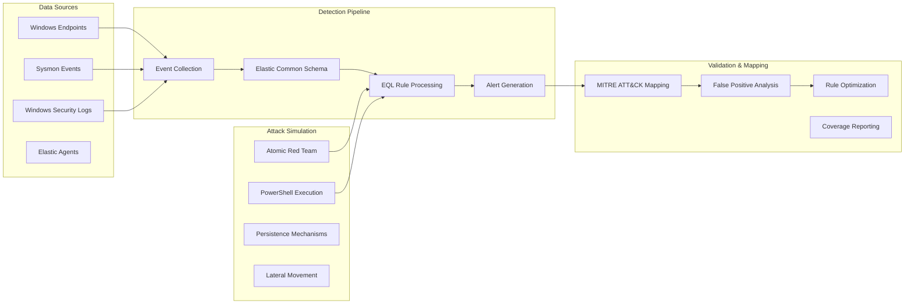

# EQL Detection Engineering Architecture

```mermaid
graph LR
    subgraph "Data Sources"
        A1[Windows Endpoints]
        A2[Sysmon Events]
        A3[Windows Security Logs]
        A4[Elastic Agents]
    end
    
    subgraph "Detection Pipeline"
        B1[Event Collection]
        B2[Elastic Common Schema]
        B3[EQL Rule Processing]
        B4[Alert Generation]
    end
    
    subgraph "Attack Simulation"
        C1[Atomic Red Team]
        C2[PowerShell Execution]
        C3[Persistence Mechanisms]
        C4[Lateral Movement]
    end
    
    subgraph "Validation & Mapping"
        D1[MITRE ATT&CK Mapping]
        D2[False Positive Analysis]
        D3[Rule Optimization]
        D4[Coverage Reporting]
    end
    
    A1 --> B1
    A2 --> B1
    A3 --> B1
    B1 --> B2
    B2 --> B3
    C1 --> B3
    C2 --> B3
    B3 --> B4
    B4 --> D1
    D1 --> D2
    D2 --> D3
```
